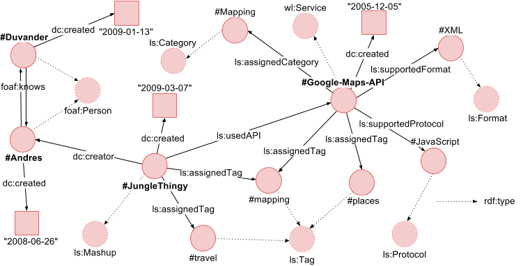

# Time-Aware Link Prediction
Author: Jaroslav Kuchar

Time-Aware Link Prediction algorithm and all additional functions are written in <a href="http://www.r-project.org/">R</a>. We model data as a tensor and use an ageing function to model retention of information over time. We run a tensor factorization followed by an evaluation of existence of links in reconstructed incidence matrices. The core of the factorization is based on the <a href="http://www.cip.ifi.lmu.de/~nickel/data/paper-icml2011.pdf">RESCAL</a> [1].

# Research
If you publish research that uses Time-Aware Link Prediction, please cite:

```
@inproceedings{Kuchar2015-WEBIST-TimeAwareLinkPrediction,
    author    = { Jaroslav Kuchar and Milan Dojchinovski and Tomas Vitvar },
    title     = { Time-Aware Link Prediction in RDF Graphs },
    booktitle = { 11th International Conference on Web Information Systems and Technologies (WEBIST) },
    year      = 2015
}
```

# Example Usage

The following graph represents an experpt of <a href="http://www.programmableweb.com">ProgrammableWeb</a> data. 



The following code imports the data and runs experiment. Note that it is only for demonstration purposes. The example does not contain significant amount of data that evolve over time to present all features of the algorithm.

```R

# import algorithm
source("./lib/talp.R")

# ageing function
ageing <- function(date1, date2="2010-12-01"){
	diff <- as.numeric(difftime(date2, date1, unit="weeks"))
	if(diff>0){
		value <- 1*exp(-0.01*diff)
	} else {
		value <- 0
	}
	return(value)
}

# define link types
linkTypes <- c("type", "knows", "creator", "assignedTag", "assignedCategory", "usedAPI", "supportedProtocol", "supportedFormat")

# define entities
entityTypes <- c("/type/Person", "/type/Mashup", "/type/Service", "/type/Category", "/type/Tag", "/type/Format", "/type/Protocol")
persons <-c("/person/Duvander", "/person/Andres")
mashups <-c("/mashup/JungleThingy")
services <- c("/service/Google-Maps-API")
formats <- c("/format/XML")
protocols <- c("/protocol/JavaScript")
categories <- c("/category/Mapping")
tags <- c("/tag/travel", "/tag/mapping", "/tag/places")
entities <- c(entityTypes, persons, mashups, services, formats, protocols, categories, tags)

# initialize tensor
t <- initializeTensor(entities, linkTypes)

# add links: source, link type, target, value of link ; 1 for "strong" links, otherwise decreased by ageing
setTensorValue(t,"/person/Duvander","type","/type/Person",1)
setTensorValue(t,"/person/Andres","type","/type/Person",1)
setTensorValue(t,"/person/Andres","knows","/person/Duvander",ageing("2008-06-26"))
setTensorValue(t,"/person/Duvander","knows","/person/Andres",ageing("2009-01-13"))

setTensorValue(t,"/mashup/JungleThingy","type","/type/Mashup",1)
setTensorValue(t,"/mashup/JungleThingy","creator","/person/Andres",ageing("2009-03-07"))
setTensorValue(t,"/mashup/JungleThingy","assignedTag","/tag/travel",ageing("2009-03-07"))
setTensorValue(t,"/mashup/JungleThingy","assignedTag","/tag/mapping",ageing("2009-03-07"))
setTensorValue(t,"/mashup/JungleThingy","usedAPI","/service/Google-Maps-API",ageing("2009-03-07"))

setTensorValue(t,"/service/Google-Maps-API","type","/type/Service",1)
setTensorValue(t,"/service/Google-Maps-API","assignedTag","/tag/mapping",ageing("2005-12-05"))
setTensorValue(t,"/service/Google-Maps-API","assignedTag","/tag/places",ageing("2005-12-05"))
setTensorValue(t,"/service/Google-Maps-API","assignedCategory","/category/Mapping",ageing("2005-12-05"))
setTensorValue(t,"/service/Google-Maps-API","supportedFormat","/format/XML",ageing("2005-12-05"))
setTensorValue(t,"/service/Google-Maps-API","supportedProtocol","/protocol/JavaScript",ageing("2005-12-05"))

setTensorValue(t,"/category/Mapping","type","/type/Category",1)
setTensorValue(t,"/tag/mapping","type","/type/Tag",1)
setTensorValue(t,"/tag/travel","type","/type/Tag",1)
setTensorValue(t,"/tag/places","type","/type/Tag",1)
setTensorValue(t,"/protocol/JavaScript","type","/type/Protocol",1)
setTensorValue(t,"/format/XML","type","/type/Format",1)

# print original tensor
printTensor(t)

# factorization, 10 latent factors, max 100 iterations and difference between iterations 0.01
factorizationOutput <- factorization(t, 10, 100, 0.01)

# predict links
predictedLinks <- topNtargets("/service/Google-Maps-API","assignedTag", t, factorizationOutput)
print(predictedLinks[grep("/tag/",predictedLinks[,1]),])
# output --> /tag/travel


```

# References

[1] Maximilian Nickel, Volker Tresp, Hans-Peter-Kriegel, "A Three-Way Model for Collective Learning on Multi-Relational Data", Proceedings of the 28th International Conference on Machine Learning (ICML'11), 809--816, ACM, Bellevue, WA, USA, 2011


# License
The GPL version 3, http://www.gnu.org/licenses/gpl-3.0.txt
